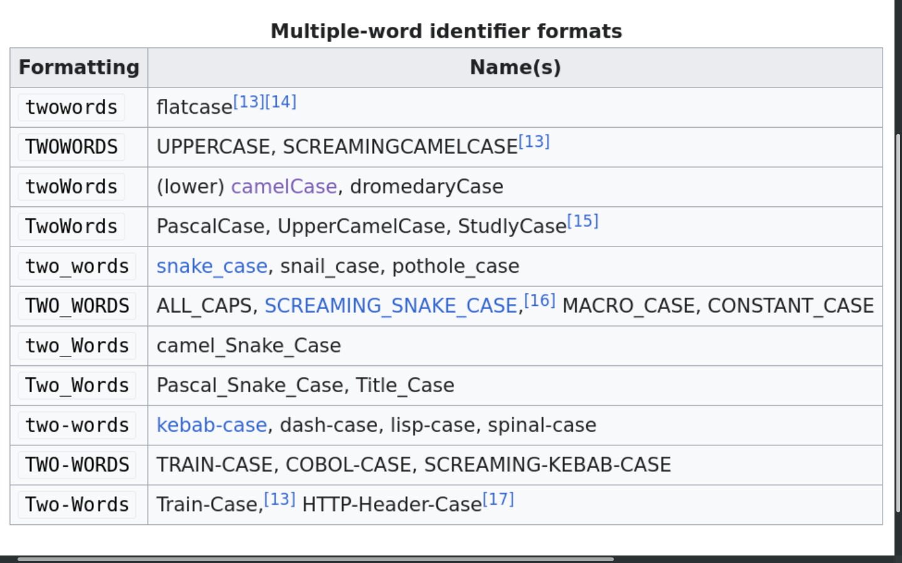

<div dir="rtl">

# قراردادهای برنامه نویسی QML

## تعریف یک Object جدید

### ترتیب attribute ها در Object جدید

</div>

1. id
2. property declarations
3. signal declarations
4. javascript functions
5. object properties
6. child objects

<div dir="rtl">

> بین تمام این 6 بخش یک خط خالی قرار میدهیم.

> بین property declarations اگر تعریف یک property چند خط بود باید یک خط بعد از آن خالی بگذارید.

> بین تمام child objects یک خط خالی قرار می دهیم.

> اگر به یک شی reference ندادید برای آن `id` تعریف نکنید.

مثال:

</div>

```QML
Rectangle {
    id: photo           // id on the first line makes it easy to find an object

    property bool thumbnail: false      // property declarations
    property alias image: photoImage.source

    signal clicked                  // signal declarations

    function doSomething(x)         // javascript functions
    {
        return x + photoImage.width
    }

    color: "gray"                   // object properties
    x: 20                           // try to group related properties together
    y: 20
    height: 150
    width: {                        // large bindings
        if (photoImage.width > 200) {
            photoImage.width;
        } else {
            200;
        }
    }

    states: [
        State {
            name: "selected"
            PropertyChanges { target: border; color: "red" }
        }
    ]

    transitions: [
        Transition {
            from: ""
            to: "selected"
            ColorAnimation { target: border; duration: 200 }
        }
    ]

    Rectangle {                     // child object
        id: border
        anchors.centerIn: parent; color: "white"

        Image {
            id: photoImage
            anchors.centerIn: parent
        }
    }

    Rectangle {                     // child object
        id: border
        anchors.centerIn: parent; color: "white"

        Image {
            id: photoImage
            anchors.centerIn: parent
        }
    }
}
```

<div dir="rtl">

### Grouped Properties

این Property ها را حتما با استفاده از `{}` بنویسید و نه با `.` حتی اگر یک 
Property از آنها را استفاده میکنید.

مثال اشتباه:

</div>

```QML
Rectangle {
    id: topBarRect

    color: "red"
    anchors.left: parent.left; 
    anchors.top: parent.top; 
    anchors.right: parent.right; 
    anchors.leftMargin: 20
    radius: 2
    border.width: 1
    border.color: "blue"
}
```

<div dir="rtl">

مثال درست:

</div>

```QML
Rectangle {
    id: topBarRect

    color: "red"
    anchors {
        left: parent.left
        top: parent.top
        right: parent.right 
        leftMargin: 20
    }
    
    radius: 2
    border {
        width: 1
        color: "blue"
    }
}
```

<div dir="rtl">

### از `parent` reference ترجیحا استفاده نکنید!

برای خوانایی بهتر و حتی Performance بهتر به جای استفاده از `parent` از `id` آن استفاده کنید.

مثال:

</div>

```QML
Item {
    id: root

    property int rectangleWidth: 50

    Rectangle {
        // width: parent.rectangleWidth // don't use this
        width: root.rectangleWidth // use this
    }
}
```

<div dir="rtl">

## کدهای js (Javascript)

### تعداد خطوط کد

- اگر یک خط کوتاه کد js دارید آن را بصورت inline بنویسید.

مثال:

</div>

```QML
Rectangle { 
    color: "blue"
    width: rectangleWidth / 3
    height: rectangleHeight / 3
}
```

<div dir="rtl">

- اگر کد در حد چندخط کوتاه است از block در همان جا استفاده کنید.

مثال:

</div>

```QML
Rectangle {
    color: "blue"
    width: {
        var w = rectangleWidth / 3
        console.debug(w)
        return w
    }
}
```
<div dir="rtl">

- اگر کدتان بیش از چند خط کوتاه است برای آن یک تابع بنویسید.

مثال:

</div>

```QML
function calculateWidth(object : Item) : double
{
    var w = object.width / 3
    // ...
    // more javascript code
    // ...
    console.debug(w)
    return w
}

Rectangle {
    width: calculateWidth(rectangleWidth) 
    height: 50
}
```

<div dir="rtl">

## قراردادهای نام گذاری

</div>

<div align="center">
    
</div>

<div align="center">

| Identifier                |         Naming Convention     |       Description     |
| ------------------------- | ----------------------------- | --------------------- |
| file name                 |           PascalCase          |       meaningful      |
| id name                   |           camelCase           |       meaningful      |
| property name             |           camelCase           |       meaningful      |
| signal name               |           camelCase           |       meaningful      |
| function name             |           camelCase           |       meaningful      |


</div>

<div dir="rtl">

# منابع

</div>

https://doc.qt.io/qt-6/qml-codingconventions.html